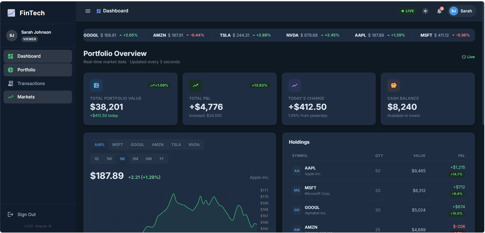
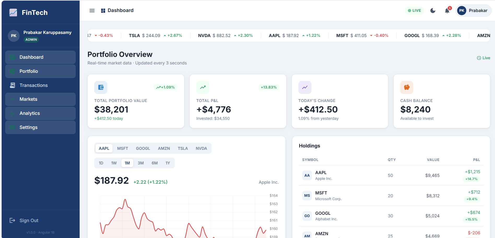
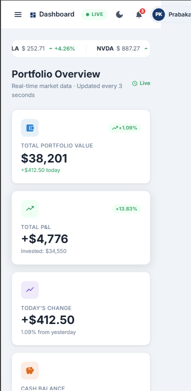

# 📈 Angular FinTech Dashboard

> **Enterprise-grade Financial Portfolio Dashboard** built with Angular 19, standalone components, Signals, NgRx, real-time Chart.js charts, SSO-style authentication, RBAC, and light/dark theme toggle.
[](https://github.com/PrabakarKaruppasamy/angular-fintech-dashboard/actions)
[](https://angular.dev)
[](https://typescriptlang.org)
[](https://chartjs.org)
[](https://rxjs.dev)

---

## 🚀 Live Demo

🔗 https://angular19-fintech-dashboard.vercel.app/login

> Deploy instantly using Vercel or Netlify — see [Deployment](#deployment).

### Demo Credentials

| Role | Email | Password |
|---|---|---|
| Admin | admin@fintech.com | admin123 |
| Viewer | viewer@fintech.com | viewer123 |

---

## ✨ Features

- 📊 **Real-Time Portfolio Summary** — live portfolio valuation, P&L, cash balance, and daily movement
- 📈 **Interactive Financial Charts** — Chart.js-powered stock performance visualization
- 💼 **Portfolio Holdings Management** — dynamic holdings table with real-time calculations
- 🧾 **Transaction History** — searchable and filterable activity log
- 🔔 **Notification Center** — alerts, order execution updates, dividend notifications
- 🔐 **Role-Based Access Control (RBAC)** — admin vs viewer permissions
- 🌙 **Dark / Light Theme Toggle** — persisted using localStorage
- 🏃 **Live Market Ticker** — animated top-bar market feed
- 📱 **Responsive Enterprise Layout** — optimized for desktop, tablet, and mobile
- ⚡ **Angular Signals Integration** — modern reactive state handling
- 🚀 **Lazy Loaded Feature Modules** — optimized application performance
- 🎯 **Standalone Components Architecture** — no NgModules

---

## 🏗️ Architecture

```text
src/
├── app/
│   ├── core/
│   │   ├── models/
│   │   ├── services/
│   │   ├── guards/
│   │   └── interceptors/
│   ├── features/
│   │   ├── auth/
│   │   ├── layout/
│   │   └── dashboard/
│   └── shared/
└── styles.scss
```

---

## ⚙️ Angular 19 Features Used

| Feature | Usage |
|---|---|
| Standalone Components | Entire application architecture |
| Angular Signals | Reactive state management |
| Computed & Effect APIs | Theme and auth state updates |
| Functional Route Guards | Route protection |
| Functional HTTP Interceptors | JWT token injection |
| Lazy Loading | Feature-based routing |
| Angular Control Flow (`@if`, `@for`) | Modern template syntax |
| View Transitions API | Smooth navigation animations |
| RxJS Streams | Real-time market simulation |
| OnPush-friendly Architecture | Performance optimization |

---

## 🔐 Security Patterns

- SSO-style authentication simulation
- JWT Bearer token injection
- Protected routes using functional guards
- Role-based sidebar rendering
- Session-based authentication persistence
- Mock API isolation for safe public demos

---

## 🛠️ Getting Started

### Prerequisites

- Node.js 20+
- npm 10+
- Angular CLI 19

Install Angular CLI globally:

```bash
npm install -g @angular/cli@19
```

---

## 📦 Installation

```bash
# Clone repository
git clone https://github.com/PrabakarKaruppasamy/angular-fintech-dashboard.git

# Navigate into project
cd angular-fintech-dashboard

# Install dependencies
npm install

# Run development server
ng serve
```

Open browser:

```text
http://localhost:4200
```

---

## 🚀 Production Build

```bash
ng build --configuration production
```

Build output:

```text
dist/angular-fintech-dashboard/browser
```

---

## 🧪 Run Unit Tests

```bash
ng test
```

---

## 🚀 Deployment

### Vercel (Recommended)

```bash
npm install -g vercel
vercel --prod
```

### Netlify

```bash
ng build --configuration production
```

Upload:

```text
dist/angular-fintech-dashboard/browser
```

to Netlify dashboard.

### GitHub Pages

```bash
ng add angular-cli-ghpages
ng deploy --base-href=/angular-fintech-dashboard/
```

---

## 📦 Tech Stack

| Technology | Version |
|---|---|
| Angular | 19.x |
| TypeScript | 5.6 |
| RxJS | 7.8 |
| NgRx | 19 |
| Chart.js | 4.4 |
| Angular Router | 19 |
| Angular Forms | 19 |
| SCSS | Latest |

---

## 🗂️ Mock Data Strategy

All financial data is mocked locally inside service layers.

Benefits:

- Runs completely offline
- Easy recruiter demo
- No API cost
- Faster development
- Easy backend replacement later

To integrate a real backend:

1. Add API URL inside environment files
2. Replace mocked observables with HTTP requests
3. Connect authentication provider (Auth0, Azure AD, Cognito, etc.)

---

## 📸 Screenshots

### Dashboard Overview

<p align="center">
  
</p>

---

### Light Theme

<p align="center">
  
</p>

---

### Mobile Responsive View

<p align="center">
  
</p>

---

## 📈 Future Improvements

- Real WebSocket market feeds
- Server-side rendering (SSR)
- Microfrontend architecture
- Advanced analytics dashboard
- AI-powered investment insights
- Cypress E2E testing
- Docker deployment
- GitHub Actions CI/CD
- Internationalization (i18n)

---

## 👤 Author

### Prabakar Karuppasamy

Frontend Architect & Technical Lead  
14+ years building enterprise Angular applications for global banking and fintech organizations.

- BNP Paribas
- Bank of America

### Connect

- LinkedIn: https://linkedin.com/in/prabakarsamy
- GitHub: https://github.com/PrabakarKaruppasamy

---

## ⭐ Support

If you found this project useful:

- Give it a ⭐ on GitHub
- Share it with other Angular developers
- Use it as a learning reference

---

## 📄 License

MIT License © 2026 Prabakar Karuppasamy